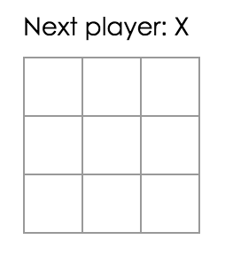
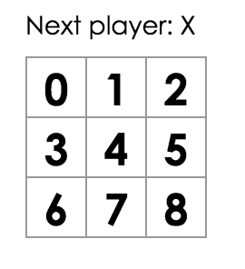

# Entry 3:
## Tic Tac Toe with React.js
##### One thing that I did know about React.js was that there is a codecademy tutorial on the topic. However, I chose not to directly dive into that tutorial as I had found a tutorial on creating a Tic Tac Toe game using React.js. This tutorial would illustrate the interactive aspect of React and the previous knowledge that I have of HTML and Javascript. The tutorial is provided by [React](https://facebook.github.io/react/tutorial/tutorial.html) and was truly helpful in beginning my journey in React.js as I was in the learning zone through out the process of creating the game.
##### The tutorial had already provided me with the shell of the code, which is seen here at: [Nakagawa's Code ](https://codepen.io/ericnakagawa/pen/vXpjwZ?editors=0010). In this code pen, the style of the game is already written, therefore, all that was left is to type out the Javscript.
##### Most of what was being coded were within the three components, the Square, Board and Game. Each component renders different amount of data. The Square component renders a ```<button>```, the Board component renders nine squares and the Game renders placeholders wihtin the board.
##### One of the key things that I have learned of React is the value of ```this.props```. This one line is what allows data to be passed from one component to the next. In the [final result](https://codepen.io/ericnakagawa/pen/ALxakj), it will display how ```this.props ``` is used multiple times in order to pass data from the Square, Board and Game.
##### An example of ```this.props```, using the [starting code](https://codepen.io/ericnakagawa/pen/vXpjwZ?editors=0010), is changing ```renderSquare``` method within the Board component to return ```<Square value={i} />```. Then within the the Square component's render method, replace ```{/* TODO */}``` with ```{this.props.value}```.


