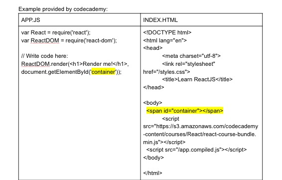

# Entry 4:
## Learning from Codecademy
#### Beginning to Understand React:

One thing that I found super comforting is that JSX code looks a lot like HTML. This gave me a sense of security and familiarity while learning. Although it is extremely similar, there are some key differences that still place me in the learning zone for React. While I coded I found myself seeing certain tags and going, “Hey! I know that one”, but, at the same time I would notice that the syntax is presented differently.

#### Things I’ve Learned about JSX elements:
If a JavaScript file contains JSX code, that file will have to be compiled. Meaning that before the file reaches a web browser, a JSX compiler will translate JSX into regular JavaScript.

The only difference between JSX elements and HTML is that it is found in a Javascript file not a HTML file.

They can go anywhere that JavaScript expressions can go.

They could be saved as a variable, passed to a function, and stored in an array or object.

##### Similarities:
JSX elements can have attributes, just like HTML elements can.

A JSX attribute is written using HTML-like syntax:
- i.e: my-attribute-name="my-attribute-value"

A JSX expression must have exactly one outermost element.
An easy fix that I learned is to just wrap the expression in a ``` <div></div> ```.


ReactDOM is the name of a JavaScript library. The library contains React methods, all of which use the DOM in some way or another.

ReactDOM.render is the most common way to render JSX. Rendering is what makes the code appear on the screen.

``` ReactDOM.render(<h1>Hello world</h1>, document.getElementById('app')); ```
``` <h1>Hello world</h1> ``` is the first argument being passed into ReactDOM.render
The first argument is appended to whatever element is selected by the second argument. In this case, the selected second argument, for this example, is the ID ‘app’ taken from the HTML file.



The correct steps in which JSX renders (learned from Codecademy's quiz):
- A JSX element renders.
- The entire virtual DOM updates.
- The virtual DOM "diffs," comparing its current self with its previous self.
- Part of the real DOM updates.
- The screen looks different than it used to.

Some other differences between JSX and HTML that I have learned is the attribute class

In HTML, class is used as an attribute name:

``` <h1 class="big">Hello</h1> ```

However, in JSX, the word class cannot be used. Instead you would have to use className

``` <h1 className="big">Hello</h1> ```

Since JSX gets translated into JavaScript, class is already a reserved word in JavaScript.
Thus, when JSX is rendered, JSX className attributes would automatically render to a class attribute.

### Takeaways:
Refresh the page: I spent a long time getting lessons wrong in the React.js tutorial provided by Codecademy because the page did not load correctly. I believed that all the code that I wrote was wrong but I couldn’t figure out what was wrong. Turns out, certain pieces of code that the tutorial was supposed to provide for the lesson didn’t load. I honestly would’ve stayed stuck on lesson 1 if I never decided to refresh the page.

Brainstorm while learning: I honestly need this advice because I've realized that I'm spending time learning about React but I haven't been thinking about what I will actually do with what I've leaned.


